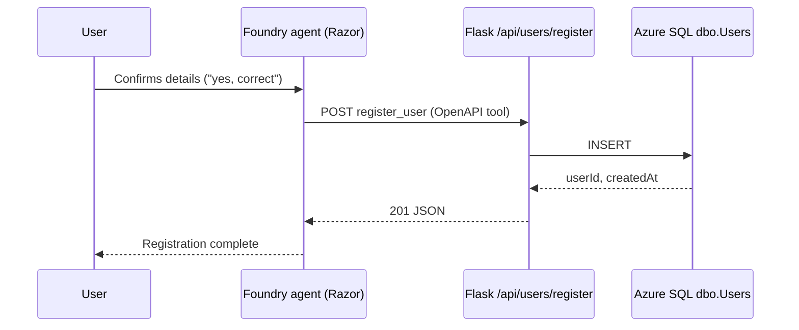

# User registration (agent → Azure SQL)

When the user **confirms** their details, the Foundry agent calls your Flask API, which inserts a row into `dbo.Users`.

## Architecture



## 1. Database connection (no password option)

You do **not** need the SQL admin password if you use **Azure AD (Entra ID)** authentication.

In `backend/.env`:

```env
AZURE_SQL_SERVER=free-sql-db-voicebot-server.database.windows.net
AZURE_SQL_DATABASE=free-sql-db-voicebot
AZURE_SQL_PORT=1433
AZURE_SQL_USE_AAD=true
# Leave AZURE_SQL_PASSWORD unset
```

**Local dev:** sign in with Azure CLI:

```bash
az login
```

**Azure App Service:** enable system-assigned managed identity (`configure-azure-app.sh` does this) and grant that identity access in SQL (step 2).

### Alternative: SQL login + password

If you prefer the `foyet` SQL user and a password:

```bash
./scripts/reset-sql-admin-password.sh <resource-group> free-sql-db-voicebot-server '<new-password>'
```

Then in `.env`:

```env
AZURE_SQL_USER=foyet
AZURE_SQL_PASSWORD=<your-password>
AZURE_SQL_USE_AAD=false
```

### Grant Azure AD access in SQL

In Azure Portal → SQL database → Query editor (or SSMS), as an admin:

```sql
-- App Service managed identity (replace with your web app name)
CREATE USER [UserRegistrationBot] FROM EXTERNAL PROVIDER;
ALTER ROLE db_datareader ADD MEMBER [UserRegistrationBot];
ALTER ROLE db_datawriter ADD MEMBER [UserRegistrationBot];

-- Your own Entra user for local testing (replace with your UPN)
CREATE USER [you@yourtenant.com] FROM EXTERNAL PROVIDER;
ALTER ROLE db_datareader ADD MEMBER [you@yourtenant.com];
ALTER ROLE db_datawriter ADD MEMBER [you@yourtenant.com];
```

Ensure the SQL server has **Microsoft Entra ID** set as admin (or a group containing you).

## 2. Run the API locally

```bash
cd backend
python -m venv .venv && source .venv/bin/activate
pip install -r requirements.txt
# macOS: brew install msodbcsql18
python app.py
```

Check:

```bash
curl -s http://localhost:5440/health | jq
```

`sqlConfigured` should be `true`.

Test insert (optional):

```bash
./scripts/test-register-api.sh http://localhost:5440
```

## 3. Expose the API to Foundry

The agent runs in Azure and must reach your API over **HTTPS**.

| Environment | What to use |
|-------------|-------------|
| Production | App Service URL, e.g. `https://userregistrationbot.azurewebsites.net` |
| Local dev | [Azure Dev Tunnel](https://learn.microsoft.com/azure/developer/dev-tunnels/) or ngrok |

Set in `backend/.env`:

```env
BACKEND_PUBLIC_URL=https://your-app.azurewebsites.net
```

The served OpenAPI spec uses this URL:

- `GET /openapi/register-user.json`
- `GET /openapi/register-user.yaml`

## 4. Attach the OpenAPI tool to agent "Razor"

### OpenAPI is not in the tool catalog

In the new Foundry portal, **OpenAPI does not appear as a ready-made catalog entry** (unlike Bing, Code Interpreter, etc.). That is expected.

You add it as a **custom** tool in one of these places:

| Where | Steps |
|-------|--------|
| **On the agent** (recommended) | [ai.azure.com](https://ai.azure.com) → your project → **Agents** → **Razor** → **Tools** → **Connect a tool** / **Add** → **Custom** → **OpenAPI** → paste or upload the spec |
| **Project tools** | **Build** → **Tools** → **Connect a tool** → **Custom** → **OpenAPI tool** → **Create** |

Then attach that tool to **Razor** and **Save** the agent (if you skip Save, the tool is not available at runtime).

Tools added only on an agent often **do not show up** in the global Tools catalog; that is a known portal limitation.

### Option A — Script (no portal hunting)

If you cannot find OpenAPI in the UI, attach the tool with the SDK:

```bash
cd backend && source .venv/bin/activate
az login
# Must be a public HTTPS URL (App Service or Dev Tunnel), not http://localhost
export BACKEND_PUBLIC_URL=https://YOUR_APP.azurewebsites.net
python ../scripts/attach-register-openapi-tool.py
```

Update `AZURE_EXISTING_AGENT_VERSION` in `.env` to the version number the script prints.

### Option B — Portal (manual)

1. Open [Microsoft Foundry](https://ai.azure.com) → project **userregistrationbot** → **Agents** → **Razor**.
2. **Tools** → **Connect a tool** → **Custom** → **OpenAPI**.
3. Upload `backend/openapi/register-user.yaml`, or paste JSON from  
   `https://<BACKEND_PUBLIC_URL>/openapi/register-user.json` (after deploy).
4. Set **Server URL** to the same value as `BACKEND_PUBLIC_URL` (must not be a placeholder).
5. Authentication:
   - **Anonymous** if `REGISTRATION_API_KEY` is not set.
   - **API key** if you set `REGISTRATION_API_KEY`: header `X-API-Key`, plus a Foundry **connection** ([docs](https://learn.microsoft.com/en-us/azure/foundry/agents/how-to/tools/openapi)).
6. **Save** the tool, then **Save** the agent; publish a new version if prompted.

## 5. Agent instructions

Copy the content of `backend/prompts/agent-registration-instructions.md` into the agent **Instructions** field in Foundry (or merge with your existing prompt).

## 6. Verify end-to-end

1. Open the chat UI (`/` on your backend).
2. Complete registration in voice or text; confirm with "yes".
3. In SQL: `SELECT TOP 10 * FROM dbo.Users ORDER BY CreatedAt DESC;`

## Troubleshooting

| Symptom | Likely cause |
|---------|----------------|
| Agent never calls the tool | OpenAPI tool not attached, or instructions don't require confirmation |
| Tool fails / timeout | `BACKEND_PUBLIC_URL` wrong; Foundry cannot reach localhost without a tunnel |
| 503 Database not configured | Missing `AZURE_SQL_*` in App Service settings |
| 500/503 Database firewall / `40615` | SQL server blocks App Service outbound IPs — enable **Allow Azure services** on the SQL server, or add outbound IPs: `az webapp show -g <rg> -n <app> --query outboundIpAddresses -o tsv` |
| 503 Azure AD sign-in failed | Run `az login` locally, or grant managed identity on SQL |
| 400 placeholder email (`none@gmail.com`) | Agent called the tool without a real email — re-collect email before confirming |
| 409 Email already registered | Duplicate `Email` (UNIQUE constraint) |
| 401 Unauthorized | `REGISTRATION_API_KEY` set on server but not in Foundry connection |
